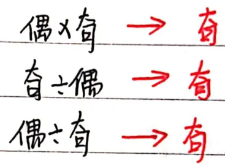
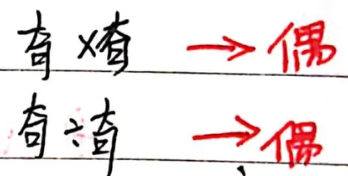
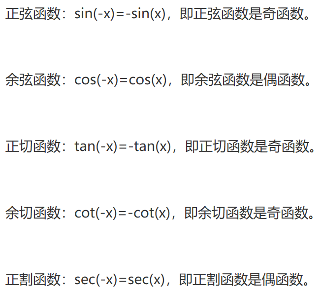

- [奇偶函数](#奇偶函数)
  - [奇偶函数的定义：](#奇偶函数的定义)
  - [奇函数和偶函数的性质：](#奇函数和偶函数的性质)
  - [如何判断奇偶性](#如何判断奇偶性)
  - [三角函数的奇偶性](#三角函数的奇偶性)
# 奇偶函数

## 奇偶函数的定义：

- 奇函数：f(-x) = -f(x)
- 偶函数：f(-x) = f(x)

奇函数的图像关于原点对称，偶函数的图像关于y轴对称。

## 奇函数和偶函数的性质：

- 奇函数的导函数是偶函数，偶函数的导函数是奇函数。
- 奇函数的积分是偶函数，偶函数的积分是奇函数。
- 奇函数的积分是偶函数，偶函数的积分是奇函数。
  
- 
- 

## 如何判断奇偶性

先判断定义域，在代公式[奇偶函数的定义](#奇偶函数的定义)

## 三角函数的奇偶性
