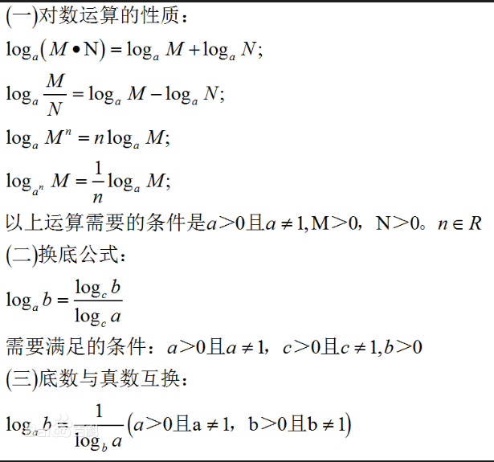
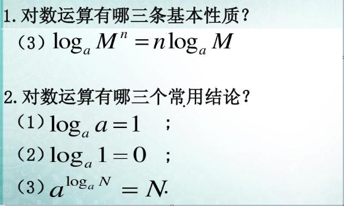

-[对数](#对数)
  - [对数](#对数)
    - [对数](#对数-1)
    - [ln函数的运算法则](#ln函数的运算法则)

# 对数

**如果a^x=N(a>0,且a≠1)，则x叫做以a为底N的对数,记做x=log(a)(N)，其中a要写于log右下。其中a叫做对数的底，N叫做真数**

## ln函数的运算法则

### 1. ln(x)

表示以e为底的x的对数，其中e约为2.71828。这是ln函数最常见的形式。

### 2. ln(e) = 1

e是自然对数的底，ln(e)等于1。

### 3. ln(1) = 0

ln(1)等于0，因为以任何正数为底的0次幂都等于1。

### 4. ln(xy) = ln(x) + ln(y)

表示对数的乘法法则，ln(xy)等于ln(x)加上ln(y)。

### 5. ln(x/y) = ln(x) - ln(y)

表示对数的除法法则，ln(x/y)等于ln(x)减去ln(y)。

### 6. ln(x^k) = k * ln(x)

表示对数的幂法法则，ln(x^k)等于k乘以ln(x)。

### 7. ln(e^x) = x

ln和指数函数e互为逆运算，ln(e^x)等于x。